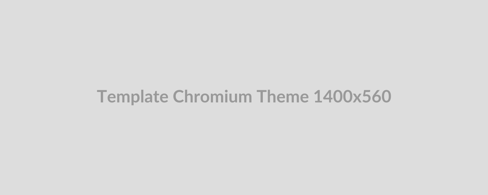

 
 

  

 
 

# Purple Ripple (Theme by I am Programmer)

_Theme for Chromium-based Web Browsers_

Dive into the elegance of Purple Ripple, a theme that combines mystery and creativity in a serene wave of purple hues.
Its smooth gradient effect adds depth and sophistication to your browsing. Made for Google Chrome and other
Chromium-based web browsers, it’s perfect for dreamers and thinkers who love graceful design.

Transform your browsing experience today with this beautiful theme, where minimalism meets elegance. With this
beautifully designed theme, you can enjoy a more pleasant and productive digital journey.

 
 

(<a href="#page_top">👆 BACK TO TOP 👆</a>)

---

# 📝 Documentation

### 📚 Official Documentation: [Our Documentation][documentation]

### 🚀 Getting Started Guide: [Quickstart][documentation]

### 💡 Examples & Demos: [Examples][documentation]

### 🎬 Tutorials & Guides: [Our Tutorials Page][youtube]

### 🎥 Video Tutorials: [YouTube Channel][youtube]

### 📖 API Reference: [API Documentation][api_documentation]

 
 

(<a href="#page_top">👆 BACK TO TOP 👆</a>)

---

# ⚒️ Usage

## Install

- ### Get it from [Google Chrome Web Store][chromewebstore]

or

- ### Install it manually

First, download the latest released ZIP file from the [releases section][releases] and save it to your computer.
Then, unzip the file and follow the instructions below, which may vary slightly depending on your browser:

- To access the Extension Management page, visit the following URL: [chrome://extensions][extensions].
  You can also open the Extension Management page by clicking on your browser's menu and
  selecting `Extensions -> Manage Extensions`.

- To enable "Developer mode," select the option located at the top right corner of the page.

- Click the `Load unpacked` button, then find the directory where you extracted the release and select it.

- The theme should now be active in your browser. To remove the theme, access your browser's theme or appearance
  settings and select a different one.

## List of Chromium-based Web Browsers

| Browser                       | Tested | Theme Supported | Browser Developer    |
| ----------------------------- | ------ | --------------- | -------------------- |
| [Google Chrome][chrome]       | ✅     | ✅              | Google               |
| [Microsoft Edge][edge]        | ✅     | ✅              | Microsoft            |
| [Ungoogle Chromium][chromium] | ✅     | ✅              | Slimjet              |
| [Vivaldi][vivaldi]            | 🔴     | ☑️              | Vivaldi Technologies |
| [Opera][opera]                | 🔴     | ☑️              | Opera Software       |
| [Brave][brave]                | 🔴     | ☑️              | Brave Software       |
|                               |        |                 |                      |

- ✅ Tested/Supported

- ☑️ Should work in theory

- 🔴 Not Tested

> [!NOTE]
>
> This theme uses `Manifest V3` to ensure compatibility with the latest Chromium extension standards.

## Screenshots

![screenshot_01_1280x800_active][screenshot_01_1280x800_active]

![screenshot_02_1280x800_inactive][screenshot_02_1280x800_inactive]

![screenshot_03_1280x800_incognito][screenshot_03_1280x800_incognito]

![screenshot_04_1280x800_appearance][screenshot_04_1280x800_appearance]

![screenshot_05_1280x800_search][screenshot_05_1280x800_search]

 
 

(<a href="#page_top">👆 BACK TO TOP 👆</a>)

---

# ✨ Get Involved

[Contributors][contributors] are what make the open source community such an amazing place to learn, inspire,
and create. Any contributions you make are greatly appreciated.

If you have a suggestion that would make this better, please fork the repo and create a pull request.
You can also simply open an issue with the tag "enhancement". Don't forget to give the project a star! Thanks again!

1. Fork the repository
2. Create a feature branch (`git checkout -b feature/amazing_feature`)
3. Make your changes with clear commit messages (`git commit -m "Add some amazing feature"`)
4. Push to the Branch (`git push origin feature/amazing_feature`)
5. Submit a pull request with description of changes

Read more about,

- [Contributing][contributing]
- [Governance][governance]
- [Contributor License Agreement][contributor_license_agreement]
- [Code of Conduct][code_of_conduct]
- [Security Policy][security]
- [Support][support]

Get in touch with the project developers and the community through our [Reddit.com Community][community] forum.

 
 

(<a href="#page_top">👆 BACK TO TOP 👆</a>)

---

# 🔥 Issues

Bug reports and feature requests can be submitted on the [Github Issues][issues].
Please read the [support.md][support] and [governance.md][governance] for more details.

> [!IMPORTANT]
>
> Please do not report security vulnerabilities through public **Community Forum**, **GitHub Issues**,
> **Discussions**, or **Pull Requests**. Instead, use [`SECURITY ADVISORIES`][security_advisories]

 
 

(<a href="#page_top">👆 BACK TO TOP 👆</a>)

---

# 👍 Code of Conduct

This project is intended to be a safe, welcoming space for collaboration, and contributors are expected to adhere to
the [Code of Conduct][code_of_conduct], [Governance][governance], [Security Policy][security],
and be bound by the terms of the [Contributor License Agreement][contributor_license_agreement].

> [!IMPORTANT]
>
> This project is not a platform for discussing politics, social issues, race, religion, gender, or sexual orientation.
> Please keep those discussions elsewhere.

 
 

(<a href="#page_top">👆 BACK TO TOP 👆</a>)

---

# ⚖️ License

This work is distributed under the [MIT License 1.0 (MIT)][license] License.

See [license][license_md] for more information.

### Permissions

- ✅ Commercial use
- ✅ Distribution
- ✅ Modification
- ⛔ ~~Patent use~~
- ✅ Private use

### Conditions

- ⛔ ~~Disclose source~~
- ✅ License and copyright notice
- ⛔ ~~Network use is distribution~~
- ⛔ ~~Same license~~
- ⛔ ~~State changes~~

### Limitations

- 🚫 Liability
- ⛔ ~~Trademark use~~
- 🚫 Warranty

 
 

(<a href="#page_top">👆 BACK TO TOP 👆</a>)

---

# 💕 Credits

- I am Programmer [@iamprogrammerlk][iamprogrammer_github]

  - 🌐 [iamprogrammer.lk][iamprogrammer_url]
  - ✉️ [contact@iamprogrammer.lk][iamprogrammer_email]

- [Contributors][contributors]

 
 

(<a href="#page_top">👆 BACK TO TOP 👆</a>)

---

# ©️ Copyright

- Copyright © 2025 🇱🇰 I am Programmer [@iamprogrammerlk][iamprogrammer_github].
- Copyright © 2025 ❤️ [Contributors][contributors].

 
 

(<a href="#page_top">👆 BACK TO TOP 👆</a>)

---

[releases]: /../../releases
[extensions]: chrome://extensions
[chrome]: https://www.google.com/chrome/
[edge]: https://www.microsoft.com/en-us/edge
[chromium]: https://github.com/ungoogled-software/ungoogled-chromium
[vivaldi]: https://vivaldi.com/
[opera]: https://www.opera.com/
[brave]: https://brave.com/
[screenshot_01_1280x800_active]: /resource/screenshot/screenshot_01_1280x800_active.png
[screenshot_02_1280x800_inactive]: /resource/screenshot/screenshot_02_1280x800_inactive.png
[screenshot_03_1280x800_incognito]: /resource/screenshot/screenshot_03_1280x800_incognito.png
[screenshot_04_1280x800_appearance]: /resource/screenshot/screenshot_04_1280x800_appearance.png
[screenshot_05_1280x800_search]: /resource/screenshot/screenshot_05_1280x800_search.png
[iamprogrammer_github]: https://github.com/iamprogrammerlk
[iamprogrammer_url]: https://iamprogrammer.lk
[iamprogrammer_email]: mailto:contact@iamprogrammer.lk
[contributors]: /../../graphs/contributors
[contributing]: /contributing.md
[governance]: /governance.md
[support]: /support.md
[issues]: /../../issues
[code_of_conduct]: /code_of_conduct.md
[security]: /security.md
[contributor_license_agreement]: /contributor_license_agreement.md
[license]: https://choosealicense.com/licenses/mit/
[license_md]: /license.md
[security_advisories]: /../../security/advisories/new
[chromewebstore]: https://chromewebstore.google.com/detail/kidahnleabdhcfhhehogmjplphjckaie
[community]: https://reddit.com/r/iamprogrammerlk
[documentation]: https://iamprogrammer.lk/theme_purple_ripple
[api_documentation]: https://iamprogrammer.lk/theme_purple_ripple
[youtube]: https://youtube.com/@iamprogrammerlk
